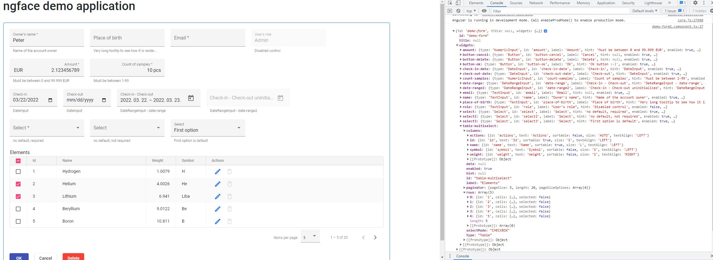
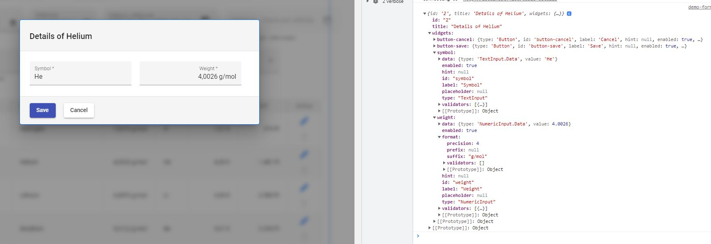
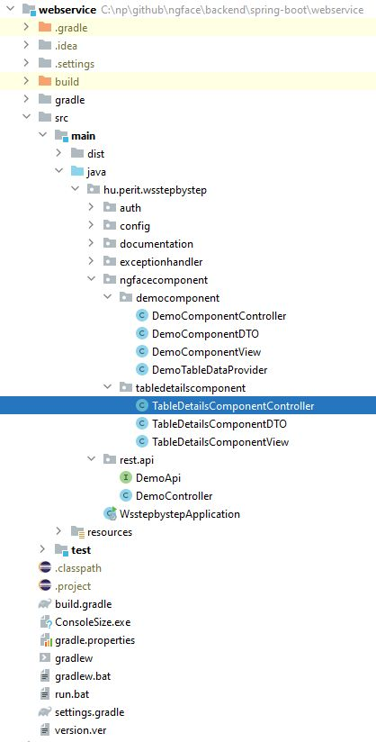

# ngface

A standardized backend-frontend communication using **widgets**. 




## Key concepts:
- The data and visual properties of UI elements are encapsulated in widgets
- Each widget has a defined JSon structure
- The widgets are defined on the backend side 
- The frontend only renders the widgets as defined by the backend
- Spring boot and Angular are used, but other fronend/backend technologies can be implemented
- The design can be customized
- MVC pattern is used in the backend
- Predefined and custom formatters can be assigned to widgets and table cells, such as `FormatCurrency.EUR`
- Backend code can be mostly generated similar to `ng generate` 

## Why?
- Frontend forms are constructed from **reusable** components => shorter development time, better quality
- To loosen backend-frontend coupling: the frontend only have to know the list of widget ids and types
- All the business logic is defined in the backend
- The frontend is solely responsible for frontend logic, **no business logic is in the frontend**
- Goal is to cover only 80% of the GUI features by **widgets**. The rest can be implemented in plain Angular, so that the maximum flexibility is available for developers

## Code samples - backend



This example is responsible for handling the communication with the frontend in order to show the `Details of Helium` modal dialog.

### Rest controller
```java
    //------------------------------------------------------------------------------------------------------------------
    // getTableDetailsForm()
    //------------------------------------------------------------------------------------------------------------------
    @Override
    public Form getTableDetailsForm(Long id)
    {
        TableDetailsComponentController.Params params = new TableDetailsComponentController.Params(id);
        log.debug("getTableDetailsForm({})", params);

        TableDetailsComponentData data = this.tableDetailsComponentController.initializeData(params);
        return new TableDetailsComponentView(data).getForm();
    }


    //------------------------------------------------------------------------------------------------------------------
    // submitTableDetailsForm()
    //------------------------------------------------------------------------------------------------------------------
    @Override
    public void submitTableDetailsForm(SubmitFormData submitFormData)
    {
        log.debug("submitTableDetailsForm({})", submitFormData);

        TableDetailsComponentData data = new TableDetailsComponentData();
        data.formSubmitted(submitFormData);
        this.tableDetailsComponentController.onSave(data);
    }

```

### ngface.tabledetailscomponent package

Each ngface backend component consists of 3 classes:
- Data class
- Controller class
- View class

#### Data class
The data class holds all the data which will be shown on the form. When the form will be submitted the `formSubmitted` method will be called with the content as a map. 

```java
@Data
public class TableDetailsComponentData implements ComponentData
{
    private String id;
    private String name;
    private Double weight;
    private String symbol;

    @Override
    public void formSubmitted(SubmitFormData submitFormData)
    {
        this.id = submitFormData.getId();
        this.weight = submitFormData.getNumericInputValue(TableDetailsComponentView.WEIGHT).doubleValue();
        this.symbol = submitFormData.getTextInputValue(TableDetailsComponentView.SYMBOL);
    }
}
```

```java
2022-03-22 16:41:14.989 INFO  --- [nio-8400-exec-5] h.p.s.s.h.HttpLoggingFilter     64 : ==> HTTP REQUEST - [REMOTE ADDRESS: 127.0.0.1] [HTTP METHOD: GET] [REQUEST URL: http://localhost:4200/table-details] [REQUEST HEADERS: accept-language:en-US,en;q=0.9,hu;q=0.8,hu-HU;q=0.7,de-DE;q=0.6,de;q=0.5|accept-encoding:gzip, deflate, br|referer:http://localhost:4200/|sec-fetch-dest:empty|sec-fetch-mode:cors|sec-fetch-site:same-origin|sec-ch-ua-platform:"Windows"|user-agent:Mozilla/5.0 (Windows NT 10.0; Win64; x64) AppleWebKit/537.36 (KHTML, like Gecko) Chrome/98.0.4758.102 Safari/537.36|sec-ch-ua-mobile:?0|accept:application/json, text/plain, */*|sec-ch-ua:" Not A;Brand";v="99", "Chromium";v="98", "Google Chrome";v="98"|connection:close|host:localhost:4200|] [REQUEST PARAMETERS: id=3] [REQUEST BODY: ] 
2022-03-22 16:41:14.993 DEBUG --- [nio-8400-exec-5] h.p.w.r.a.DemoController        76 : getTableDetailsForm(TableDetailsComponentController.Params(id=3))
2022-03-22 16:41:15.005 INFO  --- [nio-8400-exec-5] h.p.s.s.h.HttpLoggingFilter     85 : <== HTTP RESPONSE - [REMOTE ADDRESS: 127.0.0.1] [HTTP METHOD: GET] [REQUEST URL: http://localhost:4200/table-details] [RESPONSE STATUS: 200] [RESPONSE HEADERS: Vary:Origin|Vary:Origin|Vary:Origin|X-Content-Type-Options:nosniff|X-XSS-Protection:1; mode=block|Cache-Control:no-cache, no-store, max-age=0, must-revalidate|Pragma:no-cache|Expires:0|X-Frame-Options:DENY|Content-Type:application/json|Transfer-Encoding:chunked|Date:Tue, 22 Mar 2022 15:41:14 GMT|Connection:close|] [RESPONSE BODY: {"id":"3","title":"Details of Lithium","widgets":{"symbol":{"type":"TextInput","id":"symbol","label":"Symbol","hint":null,"enabled":true,"data":{"type":"TextInput.Data","value":"Li"},"placeholder":null,"validators":[{"type":"Required","message":"Symbol is required!"}]},"weight":{"type":"NumericInput","id":"weight","label":"Weight","hint":null,"enabled":true,"data":{"type":"NumericInput.Data","value":6.941},"placeholder":null,"validators":[{"type":"Required","message":"Weight is required!"}],"precision":0,"prefix":null,"suffix":"g"},"button-save":{"type":"Button","id":"button-save","label":"Save","hint":null,"enabled":true,"data":null,"style":"PRIMARY"},"button-cancel":{"type":"Button","id":"button-cancel","label":"Cancel","hint":null,"enabled":true,"data":null,"style":"NONE"}}}] 
2022-03-22 16:41:19.774 INFO  --- [nio-8400-exec-6] h.p.s.s.h.HttpLoggingFilter     64 : ==> HTTP REQUEST - [REMOTE ADDRESS: 127.0.0.1] [HTTP METHOD: POST] [REQUEST URL: http://localhost:4200/table-details] [REQUEST HEADERS: accept-language:en-US,en;q=0.9,hu;q=0.8,hu-HU;q=0.7,de-DE;q=0.6,de;q=0.5|accept-encoding:gzip, deflate, br|referer:http://localhost:4200/|sec-fetch-dest:empty|sec-fetch-mode:cors|sec-fetch-site:same-origin|origin:http://localhost:4200|sec-ch-ua-platform:"Windows"|user-agent:Mozilla/5.0 (Windows NT 10.0; Win64; x64) AppleWebKit/537.36 (KHTML, like Gecko) Chrome/98.0.4758.102 Safari/537.36|sec-ch-ua-mobile:?0|content-type:application/json|accept:application/json, text/plain, */*|sec-ch-ua:" Not A;Brand";v="99", "Chromium";v="98", "Google Chrome";v="98"|content-length:130|connection:close|host:localhost:4200|] [REQUEST PARAMETERS: ] [REQUEST BODY: {"id":"3","widgetDataMap":{"symbol":{"type":"TextInput.Data","value":"Liba"},"weight":{"type":"NumericInput.Data","value":6.941}}}] 
2022-03-22 16:41:19.821 DEBUG --- [nio-8400-exec-6] h.p.w.r.a.DemoController        89 : submitTableDetailsForm(SubmitFormData{id='3', widgetDataMap=[
        'symbol' => TextInput.Data(super=Value(super=WidgetData(type=TextInput.Data), value=Liba))
        'weight' => NumericInput.Data(super=Value(super=WidgetData(type=NumericInput.Data), value=6.941))]})
2022-03-22 16:41:19.824 INFO  --- [nio-8400-exec-6] h.p.s.s.h.HttpLoggingFilter     85 : <== HTTP RESPONSE - [REMOTE ADDRESS: 127.0.0.1] [HTTP METHOD: POST] [REQUEST URL: http://localhost:4200/table-details] [RESPONSE STATUS: 200] [RESPONSE HEADERS: Vary:Origin|Vary:Origin|Vary:Origin|X-Content-Type-Options:nosniff|X-XSS-Protection:1; mode=block|Cache-Control:no-cache, no-store, max-age=0, must-revalidate|Pragma:no-cache|Expires:0|X-Frame-Options:DENY|] [RESPONSE BODY: ]
```

#### Controller class
The controller class is a Spring service, which is called from the Rest controller and creates an instance of the appropriate data class. This is the place where other services or JPA repositories can be injected to gethear the data.

```java
@Service
@RequiredArgsConstructor
@Slf4j
public class TableDetailsComponentController implements ComponentController<TableDetailsComponentController.Params, TableDetailsComponentData>
{
    @Data
    public static class Params
    {
        private final Long id;
    }

    private final DemoTableDataProvider demoTableDataProvider;


    @Override
    public TableDetailsComponentData initializeData(Params params)
    {
        TableDetailsComponentData data = new TableDetailsComponentData();
        Optional<DemoTableDataProvider.DataRow> optTableRow = this.demoTableDataProvider.getTableRow(params.id);
        if (optTableRow.isPresent())
        {
            DemoTableDataProvider.DataRow dataRow = optTableRow.get();
            data.setId(String.valueOf(params.id));
            data.setName(dataRow.getName());
            data.setSymbol(dataRow.getSymbol());
            data.setWeight(dataRow.getWeight());
            return data;
        }

        throw new RuntimeException(String.format("No data found with id: %d", params.id));
    }


    @Override
    public void onSave(TableDetailsComponentData data)
    {
        Optional<DemoTableDataProvider.DataRow> optTableRow = this.demoTableDataProvider.getTableRow(Long.valueOf(data.getId()));
        if (optTableRow.isPresent())
        {
            DemoTableDataProvider.DataRow dataRow = optTableRow.get();
            dataRow.setWeight(data.getWeight());
            dataRow.setSymbol(data.getSymbol());
        }
    }
}
```

#### View class

The view class receives the data in the constructor. Its task is to create the Form object holding all the widgets. Simply put, the row data will be enriched here with rendering information, such as
- label
- value
- placeholder
- hint (tooltip)
- validators

```java
@RequiredArgsConstructor
public class TableDetailsComponentView implements ComponentView
{
    public static final String WEIGHT = "weight";
    public static final String SYMBOL = "symbol";

    private final TableDetailsComponentData data;

    @Override
    public Form getForm()
    {
        return new Form(data.getId())
                .title(String.format("Details of %s", this.data.getName()))
                .addWidget(new TextInput(SYMBOL).value(this.data.getSymbol()).label("Symbol").addValidator(new Required("Symbol is required!")))
                .addWidget(new NumericInput(WEIGHT)
                        .value(BigDecimal.valueOf(this.data.getWeight()))
                        .label("Weight")
                        .format(Constants.ATOMIC_WEIGHT_FORMAT)
                        .addValidator(new Required("Weight is required!"))
                )
                .addWidget(Button.SAVE)
                .addWidget(Button.CANCEL)
                ;
    }
}
```

## Code samples - frontend
### demo-dialog1.component.html
```html
<h1 mat-dialog-title>{{data.title}}</h1>
<div mat-dialog-content (keydown.enter)="onOkClick()">
  <ngface-text-input [formGroup]="formGroup" [formData]="formData" [widgetId]="'symbol'" cdkFocusInitial></ngface-text-input>
  <ngface-numeric-input [formGroup]="formGroup" [formData]="formData" [widgetId]="'weight'"></ngface-numeric-input>
</div>
<div mat-dialog-actions>
  <ngface-button [formData]="formData" [widgetId]="'button-save'" (click)="onOkClick()"></ngface-button>
  <ngface-button [formData]="formData" [widgetId]="'button-cancel'" (click)="onCancelClick()"></ngface-button>
</div>
```
### demo-dialog1.component.ts

```typescript
@Component({
  selector: 'app-demo-dialog1',
  templateUrl: './demo-dialog1.component.html',
  styleUrls: ['./demo-dialog1.component.scss']
})
export class DemoDialog1Component extends FormBaseComponent implements OnInit
{
  constructor(public dialogRef: MatDialogRef<DemoDialog1Component>,
              @Inject(MAT_DIALOG_DATA) public data: TypeModels.Form,
              private demoService: DemoService)
  {
    super();
  }

  ngOnInit(): void
  {
    this.formData = this.data;
  }

  onCancelClick(): void
  {
    this.dialogRef.close();
  }

  onOkClick()
  {
    this.formGroup.markAllAsTouched();
    if (!this.formGroup.valid)
    {
      console.warn('Data is invalid!');
    } else
    {
      this.dialogRef.close(this.getSubmitData());
    }
  }
}
```

### demo-form1.component.ts
```typescript
  private doEditAction(row: TypeModels.Row | undefined)
  {
    if (!row)
    {
      return;
    }

    this.demoService.getTableDetailsForm(row.id).subscribe(dialogData =>
    {
      console.log(dialogData);
      const dialogRef = this.dialog.open(DemoDialog1Component, {
        width: '590px',
        data: dialogData,
        backdropClass: 'ngface-modal-dialog-backdrop'
      });

      dialogRef.afterClosed().subscribe(result =>
      {
        console.log(result);
        if (result)
        {
          this.demoService.submitTableDetailsForm({id: row.id, widgetDataMap: result}).subscribe(
            () => console.log('sumbitted'),
            error => console.log(error));

          // reload table content
          row.cells['symbol'].value = result['symbol'].value;
          row.cells['weight'].value = result['weight'].value;
        }
      });
    });
  }
```
# Open issues

- NumericInputnál csak a megadott számú tizedes jegyet lehessen beírni
- DateRangeInput típusú inputoknál időzóna eltérés
- DateInput formázás magyar dátumformátumra
- Kellene PasswordInput. Vagy legyen a TextInputnak egy plusz paramétere vagy egy speciális validátora
- 

