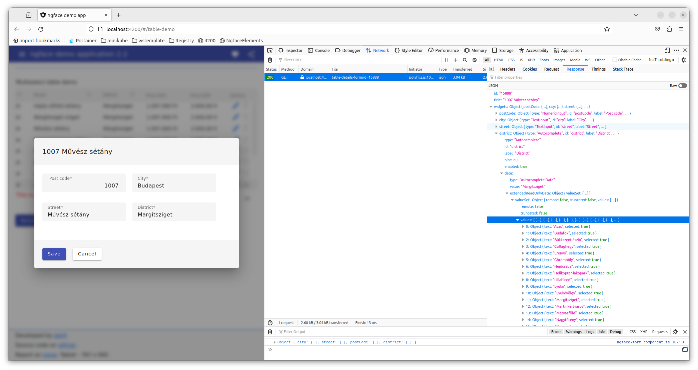
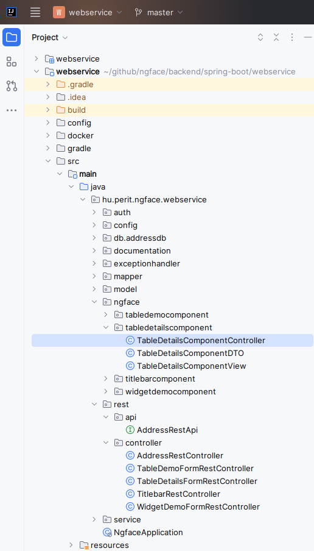

<!-- TOC -->
* [ngface](#ngface)
  * [Benefits](#benefits)
  * [Key concepts:](#key-concepts)
  * [Code samples - backend](#code-samples---backend)
    * [DTO class](#dto-class)
    * [Controller class](#controller-class)
    * [View class](#view-class)
    * [Rest controller](#rest-controller)
  * [Code samples - frontend](#code-samples---frontend)
    * [demo-dialog1.component.html](#demo-dialog1componenthtml)
    * [demo-dialog1.component.ts](#demo-dialog1componentts)
    * [demo-form1.component.ts](#demo-form1componentts)
  * [Backend code generator](#backend-code-generator)
* [Open issues](#open-issues)
* [Contact](#contact)
<!-- TOC -->

# ngface

A light-weight backend-frontend communication using **widgets**. 


## Benefits
- We want to build our frontend from **pre-built, reusable, well-tested** components => shorter development time, better quality.
- Ngface is an **abstraction layer above Angular Material** components. The API of the Angular Material components are all different, while Ngface provides a unified API throughout all widgets.
- Ngface is not only a frontend lib, it has a backend part as well, allowing us to easily put all the data together, which are needed to render a widget.
- At submission of the form, the submitted data will be automatically converted to Java classes and types, we do not have to worry about Json conversion.
- Goal is to cover 80% of the GUI features by **widgets**. The rest can be implemented in plain Angular, so that the maximum flexibility is available for developers
- The styling can be fully customized.


## Key concepts:
- The data and visual properties, such as length, precision, validators of UI elements are encapsulated in pre-defined widgets.
- Clear separation of business- and frontend logic. The frontend is solely responsible for the layout and for frontend logic, **the content comes from the backend, no business logic is in the frontend**.
- i18n is made only in the backend
- Spring boot and Angular are used, but other frontend/backend technologies can be implemented
- MVC pattern is used in the backend
- Predefined and custom formatters can be assigned to widgets and table cells, such as `FormatCurrency.EUR`
- Backend code can be mostly generated similar to `ng generate` 

## Code samples - backend

The app looks like this:



The project structure:




Each ngface backend component consists of 3 classes:
- **Controller class**: responsible for filling the DTO class with data
- **DTO class**: transfers the poor form data from the Controller to the View
- **View class**: creates a Form object, by extending the DTO class with visual properties, such as field length, precision, validators, etc

### DTO class
The DTO class holds all the data which will be shown on the form. When the form is submitted the `formSubmitted` method of the `ComponentDTO` class will be called with the content as a map. The individual values will be extracted by reflection in the parent class according the `@DTOValue` annotation. 

```java
@Data
public class TableDetailsComponentDTO extends ComponentDTO
{
    // Id of the data row
    @DTOId
    @NotNull
    private String id;

    // Name of the modal. Not annotated with @DTOValue because it will not be sumbitted by the frontend
    private String name;

    @DTOValue(id = AddressTableRow.COL_POSTCODE)
    @NotNull
    private Integer postCode;

    @DTOValue(id = AddressTableRow.COL_CITY)
    @NotNull
    @Size(min = 2, max = 20)
    private String city;

    @DTOValue(id = AddressTableRow.COL_STREET)
    @NotNull
    @Size(min = 2, max = 30)
    private String street;

    @DTOValue(id = AddressTableRow.COL_DISTRICT)
    @NotNull
    @Size(min = 2, max = 20)
    private String district;
}
```

```java
2023-10-23 07:34:46.326 INFO  --- [nio-8400-exec-6] h.p.s.s.h.HttpLoggingFilter     75 : ==> HTTP REQUEST - [REMOTE ADDRESS: 172.17.0.2] [HTTP METHOD: POST] [REQUEST URL: http://localhost:4200/frontend/forms/table-details] [REQUEST HEADERS: sec-fetch-site:same-origin|sec-fetch-mode:cors|sec-fetch-dest:empty|cookie:_pk_id.1.1fff=9e20f9c9fe0d7195.1696920195.; JSESSIONID=E965082B416195FAB23932A7D97E7CAD|referer:http://localhost:4200/|connection:close|origin:http://localhost:4200|content-length:266|content-type:application/json|accept-encoding:gzip, deflate, br|accept-language:en-US,en;q=0.5|accept:application/json, text/plain, */*|user-agent:Mozilla/5.0 (X11; Ubuntu; Linux x86_64; rv:109.0) Gecko/20100101 Firefox/118.0|host:localhost:4200|] [REQUEST PARAMETERS: ]  
2023-10-23 07:34:46.329 DEBUG --- [nio-8400-exec-6] p.s.s.r.LoggedRestMethodAspect  86 : >>> | 172.17.0.2 | null | user: anonymousUser | host: null | system: ngface-demo-app | eventId: 302 | event: submitForm | {"submitFormData":{"id":"13304","widgetDataMap":{"city":{"type":"TextInput.Data","value":"Budapest"},"street":{"type":"TextInput.Data","value":"Hajós Alfréd sétány"},"district":{"type":"TextInput.Data","value":"Margitsziget"},"postCode":{"type":"NumericInput.Data","value":1007}}}}  
2023-10-23 07:34:46.352 DEBUG --- [nio-8400-exec-6] h.p.n.c.d.ComponentDTO          61 : TableDetailsComponentDTO(id=13304, name=null, postCode=1007, city=Budapest, street=Hajós Alfréd sétány, district=Margitsziget) 
2023-10-23 07:34:46.357 DEBUG --- [nio-8400-exec-6] h.p.s.c.t.Took                 137 : h.p.n.w.r.TableDetailsRestController.submitForm() took 30 ms. Start time: 2023-10-23 07:34:46.327, end time: 2023-10-23 07:34:46.357 
```

### Controller class
The controller class is a Spring service, which is called from the Rest controller and creates an instance of the appropriate data class. This is the place where other services or JPA repositories can be injected to gethear the data.

```java
@Service
@RequiredArgsConstructor
@Slf4j
public class TableDetailsComponentController implements ComponentController<TableDetailsComponentDTO, Long>
{
    private final AddressService addressService;
    
    @Override
    public TableDetailsComponentDTO getForm(Long id)
    {
        if (id % 2 != 0)
        {
            throw new ApplicationRuntimeException(ApplicationMessage.ONLY_EVEN_IDS_CAN_BE_EDITED);
        }

        TableDetailsComponentDTO data = new TableDetailsComponentDTO();
        try
        {
            AddressEntity addressEntity = this.addressService.find(id);
            data.setId(String.valueOf(id));
            data.setName(addressEntity.getStreet());
            data.setPostCode(addressEntity.getPostCode());
            data.setCity(addressEntity.getCity());
            data.setStreet(addressEntity.getStreet());
            data.setDistrict(addressEntity.getDistrict());
            return data;
        }
        catch (ResourceNotFoundException e)
        {
            throw new RuntimeException(String.format("No data found with id: '%d'", id));
        }
    }


    @Override
    public void onFormSubmit(TableDetailsComponentDTO data)
    {
        this.addressService.update(Long.parseLong(data.getId()), data.getPostCode(), data.getCity(), data.getStreet(), data.getDistrict());
    }
}
```

### View class

The view class receives the data in the constructor. Its task is to create the Form object holding all the widgets. Simply put, the row data will be enriched here with rendering information, such as
- label
- value
- placeholder
- hint (tooltip)
- validators

```java
@RequiredArgsConstructor
public class TableDetailsComponentView implements ComponentView
{
    public static final String INVALID_LENGTH = "Invalid length!";

    private final TableDetailsComponentDTO data;


    @Override
    public Form getForm()
    {
        return new Form(data.getId())
            .title(String.format("%s %s", this.data.getPostCode(), this.data.getName()))
            .addWidget(new NumericInput(AddressTableRow.COL_POSTCODE)
                .value(this.data.getPostCode())
                .label("Post code")
                .format(NumericFormat.UNGROUPED)
                .addValidator(new Required("Post code is required!"))
                .addValidator(new Min(1000.0, "Postal code must be between 1000 and 9999"))
                .addValidator(new Max(9999.0, "Postal code must be between 1000 and 9999"))
            )
            .addWidget(new TextInput(AddressTableRow.COL_CITY)
                .value(this.data.getCity())
                .label("City")
                .addValidator(new Required("City is required!"))
                .addValidator(new Size(INVALID_LENGTH).min(2).max(20))
            )
            .addWidget(new TextInput(AddressTableRow.COL_STREET)
                .value(this.data.getStreet())
                .label("Street")
                .addValidator(new Required("Street is required!"))
                .addValidator(new Size(INVALID_LENGTH).min(2).max(30))
            )
            .addWidget(new TextInput(AddressTableRow.COL_DISTRICT)
                .value(this.data.getDistrict())
                .label("District")
                .addValidator(new Required("District is required!"))
                //.addValidator(new Size(INVALID_LENGTH).min(2).max(20))
            )
            .addWidget(Button.SAVE)
            .addWidget(Button.CANCEL)
            ;
    }
}
```

### Rest controller
```java
@RestController
@Slf4j
@RequestMapping("/frontend/forms/table-details")
public class TableDetailsRestController
    extends NgfaceFormRestController<TableDetailsComponentController, TableDetailsComponentDTO, TableDetailsComponentView, Long>
{
    public TableDetailsRestController(TableDetailsComponentController componentController)
    {
        super(componentController);
    }


    @Override
    @LoggedRestMethod(eventId = Constants.TABLE_DETAILS_CONTROLLER_GET_FORM, subsystem = Constants.SUBSYSTEM_NAME)
    public Form getForm(Long id)
    {
        return super.getForm(id);
    }


    @Override
    @LoggedRestMethod(eventId = Constants.TABLE_DETAILS_CONTROLLER_SUBMIT_FORM, subsystem = Constants.SUBSYSTEM_NAME)
    public void submitForm(SubmitFormData submitFormData)
    {
        super.submitForm(submitFormData);
    }


    @Override
    protected TableDetailsComponentView supplyView(TableDetailsComponentDTO data)
    {
        return new TableDetailsComponentView(data);
    }


    @Override
    protected TableDetailsComponentDTO supplyDTO()
    {
        return new TableDetailsComponentDTO();
    }
}
```

## Code samples - frontend
### demo-dialog1.component.html
```html
<div mat-dialog-title>{{data.title}}</div>
<ngface-form [formdata]="formData" mat-dialog-content (keydown.enter)="onOkClick()">
    <div class="ngface-row">
        <ngface-numeric-input [formdata]="formData" widgetid="postCode"></ngface-numeric-input>
    </div>
    <div class="ngface-row">
        <ngface-text-input [formdata]="formData" widgetid="city"></ngface-text-input>
    </div>
    <div class="ngface-row">
        <ngface-text-input [formdata]="formData" widgetid="street"></ngface-text-input>
    </div>
    <div class="ngface-row">
        <ngface-text-input [formdata]="formData" widgetid="district"></ngface-text-input>
    </div>
</ngface-form>
<div mat-dialog-actions>
    <ngface-button [formdata]="formData" widgetid="button-save" (click)="onOkClick()"></ngface-button>
    <ngface-button [formdata]="formData" widgetid="button-cancel" (click)="onCancelClick()"></ngface-button>
</div>
```

### demo-dialog1.component.ts

```typescript
@Component({
    selector: 'app-demo-dialog1',
    templateUrl: './demo-dialog1.component.html',
    styleUrls: ['./demo-dialog1.component.scss'],
    standalone: true,
    imports: [MatDialogModule, NgfaceFormComponent, NgfaceNumericInputComponent, NgfaceTextInputComponent, NgfaceButtonComponent]
})
export class DemoDialog1Component extends FormBaseComponent implements OnInit
{
    constructor(public dialogRef: MatDialogRef<DemoDialog1Component>,
                @Inject(MAT_DIALOG_DATA) public data: Ngface.Form)
    {
        super();
    }

    ngOnInit(): void
    {
        this.formData = this.data;
    }

    onCancelClick(): void
    {
        this.dialogRef.close();
    }

    onOkClick(): void
    {
        this.formGroup.markAllAsTouched();
        if (!this.formGroup.valid)
        {
            console.warn('Data is invalid!');
        }
        else
        {
            const submitData = this.getSubmitData();
            console.log(submitData);
            this.dialogRef.close(submitData);
        }
    }
}
```

### demo-form1.component.ts
```typescript
private doEditAction(row: Ngface.Row<number> | undefined): void
{
    if (!row)
    {
        return;
    }

    const rowid: number = row.id;
    // Reading dialog data from the backend
    this.tableDetailsService.getTableDetailsForm(rowid).subscribe(dialogData =>
    {
        console.log(dialogData);
        // Open dialog
        const dialogRef = this.dialog.open(DemoDialog1Component, {
            data: dialogData,
            backdropClass: 'ngface-modal-dialog-backdrop'
        });
    
        // Subscribe to afterClosed
        dialogRef.afterClosed().subscribe(result =>
        {
            if (result)
            {
                // Submitting new data to the backend
                this.tableDetailsService.submitTableDetailsForm({id: row.id.toString(), widgetDataMap: result}).subscribe(
                    () =>
                    {
                        console.log('sumbitted');
                        // reload table content
                        this.demoFormTableService.getDemoFormTableRow(row.id).subscribe(data =>
                        {
                            console.log(data);
                            // @ts-ignore
                            row.cells = data.widgets['table-multiselect'].rows[0].cells;
                        });
                    },
                    error => console.log(error));
            }
        });
    });
}
```


## Backend code generator

See the [`generator`](https://github.com/nagypet/ngface/tree/development/backend/spring-boot/generator) subproject.

```
c:\np\github\ngface\backend\spring-boot\webservice\src\main\java\hu\perit\wsstepbystep\ngfacecomponent>ngf -n New
NewComponentDTO.java generated
NewComponentController.java generated
NewComponentView.java generated
```


# Open issues

- PasswordInput
- Autocomplete component

# Contact
Developed by [perit](https://perit.hu).

Try in on [http://ngface.perit.hu](http://ngface.perit.hu)
