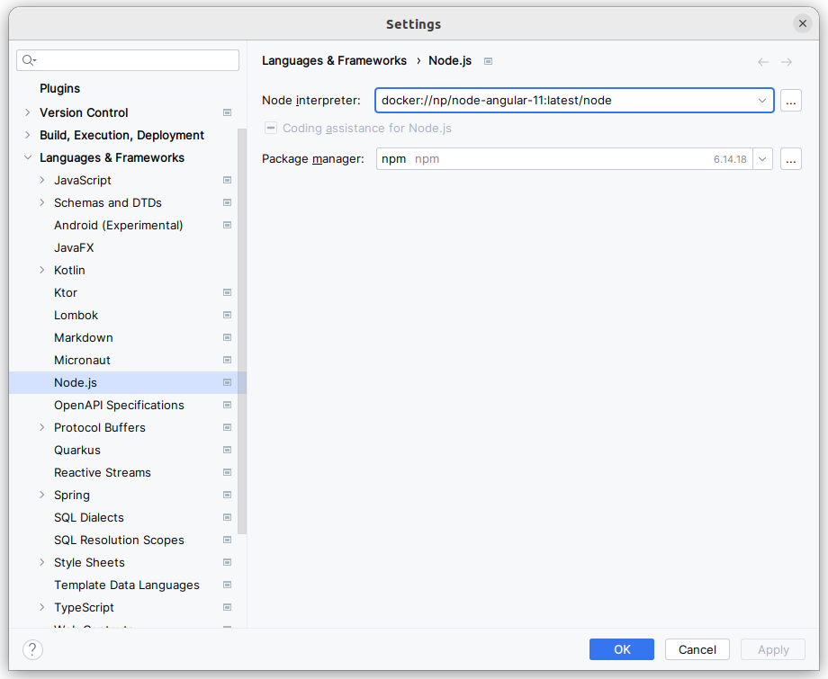
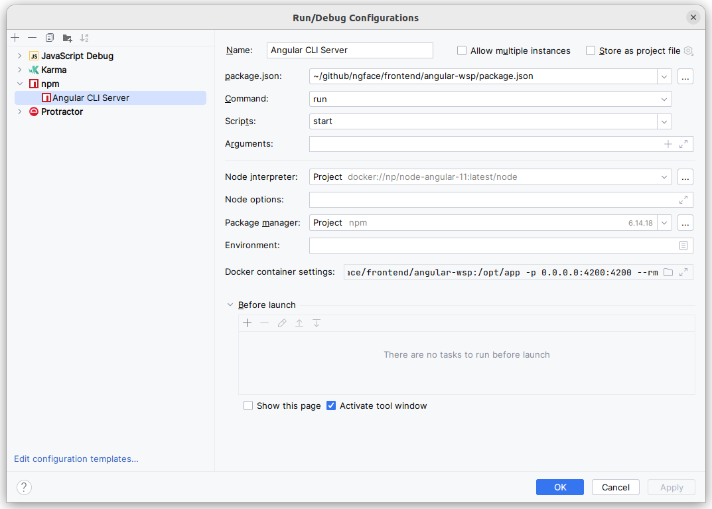
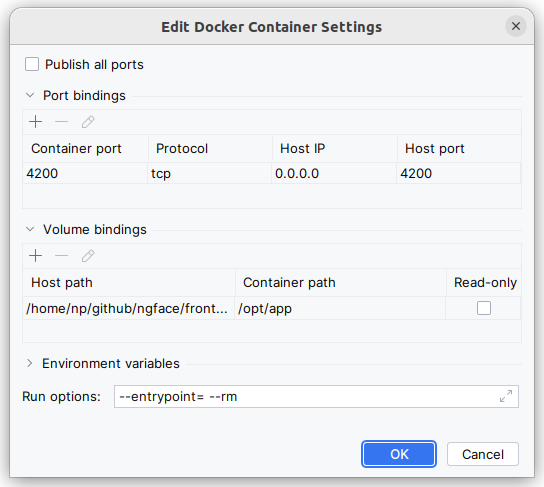
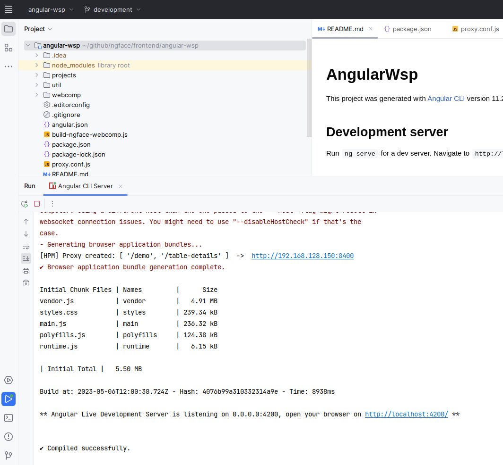
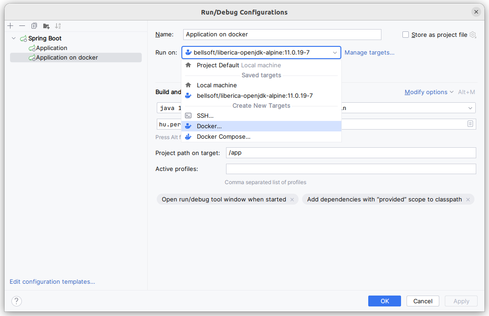
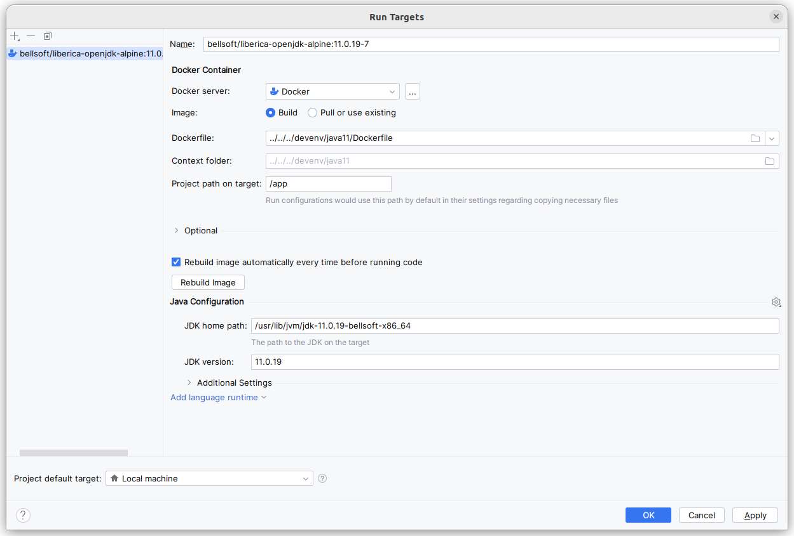

# Development environments in docker

Anyone who develops several projects in parallel has most likely encountered the problem when projects required different JDKs. The problem is more serious with Angular, because the versions of Node.js, npm and Angular-CLI must match each other.

Fortunately, IntelliJ Idea includes support for these cases. Let's look at the frontend first.

## Dockerized devenv for Angular

What do we want to achieve? We want to develop and run Angular applications without installing Node.js on our development computer. Instead, those dependencies should only be installed in a docker container, where project sources are mounted as a volume.

Source: /devenv/angular11

### Building the image
Dockerfile:
```
FROM node:14

WORKDIR /opt/app

ENV PATH /opt/app/node_modules/.bin:$PATH

RUN apt-get update
RUN apt-get -y install mc

RUN npm install -g @angular/cli@11.2.19

EXPOSE 4200

CMD /bin/bash
```

Build it with the command:
```shell
docker build . -t np/node-angular-11
```

### Running the development environment

Change to the folder `frontend/angular-wsp` and run the command `run-devenv.sh`. The container will be started, and we get a shell prompt. In here we can run the usual commands: `npm install` and `npm start`.

### Integration with IntelliJ IDEA

In order ts-lint to work we have to configure the Node.js path. For that open File/Settings and configure like this:



After that static code checking will work. We can even start the Angular CLI Server from the IDE with some small change in the run-configuration:





## Dockerized devenv for Spring Boot

Running the backend in docker is even easier. Just open the run config and choose Docker in the `Run on` list.





Dockerfile:
```
FROM bellsoft/liberica-openjdk-alpine:11.0.19-7
EXPOSE 8400
```

```
/usr/lib/jvm/jdk-11.0.19-bellsoft-x86_64/bin/java -XX:TieredStopAtLevel=1 -Dspring.output.ansi.enabled=always -Dcom.sun.management.jmxremote -Dspring.jmx.enabled=true -Dspring.liveBeansView.mbeanDomain -Dspring.application.admin.enabled=true -Dmanagement.endpoints.jmx.exposure.include=* -Dcom.sun.management.jmxremote.port=35307 -Dcom.sun.management.jmxremote.rmi.port=35307 -Dcom.sun.management.jmxremote.host=0.0.0.0 -Djava.rmi.server.hostname=0.0.0.0 -Dcom.sun.management.jmxremote.authenticate=false -Dcom.sun.management.jmxremote.ssl=false -Dfile.encoding=UTF-8 -classpath /tmp/b90164be-6b1f-4b5f-8ec6-75afbb47b0a9:/tmp/3c48855d-8682-4269-b396-742f25c5244b:/tmp/bfd47247-7b31-4ffd-8a27-fb7fe1515e0d/lombok-1.18.20.jar:/tmp/e8a16f20-fa26-44ed-91aa-3cea9608b928:/tmp/22841f91-007e-4356-a642-776f0d58966b/spvitamin-core-2.0.2-RELEASE.jar:/tmp/96dc90b3-bda0-4ba8-91c0-83aa17304023/spvitamin-spring-general-2.0.2-RELEASE-plain.jar:/tmp/0fc3082e-589b-453f-b156-71c1b44a72d6/spvitamin-spring-server-2.0.2-RELEASE-plain.jar:/tmp/b2ea23c4-64e6-4bb3-a6b5-a747c2a2700a/spvitamin-spring-logging-2.0.2-RELEASE-plain.jar:/tmp/659dcc84-278c-4468-a114-9972cb1a6528/spvitamin-spring-admin-2.0.2-RELEASE-plain.jar:/tmp/1a907002-1954-49fc-8d91-999243049a88/spvitamin-spring-security-2.0.2-RELEASE-plain.jar:/tmp/bd7fbbbc-2483-4add-8969-3e30887ec895/spring-boot-starter-web-2.4.5.jar:/tmp/49bc073a-fb5c-4141-84f2-957871b75937/spring-boot-starter-security-2.4.5.jar:/tmp/f357ed0f-9654-4450-b6ae-bc47734ea430/spring-boot-starter-thymeleaf-2.4.5.jar:/tmp/ff814798-6c6b-49f4-a501-a11576f0b6ec/spring-boot-starter-validation-2.4.5.jar:/tmp/ebc79d74-e445-4d66-853a-95b584c306a8/springfox-boot-starter-3.0.0.jar:/tmp/1bf183ab-55b0-4fa4-a598-3b1b7fdea70d/springfox-swagger-ui-3.0.0.jar:/tmp/e11ef8be-ea67-4fd9-aac1-533da3519f90/commons-lang3-3.10.jar:/tmp/77df5ba2-5a5b-4891-bf73-2972ee4443cb/validation-api-2.0.1.Final.jar:/tmp/90c318db-858c-4260-b6e3-5b6605a44727/guava-31.1-jre.jar:/tmp/099befb6-7b95-47d8-a60f-736982160e97/slf4j-api-1.7.30.jar:/tmp/eff18db0-520b-4236-8ff1-675028a5d557/spring-boot-starter-json-2.4.5.jar:/tmp/734191df-2976-4957-abe7-763a3ab06a25/spring-boot-starter-2.4.5.jar:/tmp/40df5a18-7c1e-447e-a9f8-81c7a7637911/spring-boot-starter-tomcat-2.4.5.jar:/tmp/c71b7e51-4bf1-4bfd-bf72-71d754b25f53/spring-webmvc-5.3.6.jar:/tmp/b9affb52-ae42-4309-9460-d18815629298/spring-web-5.3.6.jar:/tmp/3106f786-ccd3-4368-a9fc-eaa5ec11cc9e/spring-security-web-5.4.6.jar:/tmp/8b79975a-07fe-4c0d-86bf-ffc24d6234e6/spring-security-config-5.4.6.jar:/tmp/1f5697e7-42ce-4097-b65f-78f5ad72165d/spring-aop-5.3.6.jar:/tmp/03617d7e-7b83-430c-b36a-6469ee3ce175/thymeleaf-spring5-3.0.12.RELEASE.jar:/tmp/d4f536d2-2a70-4638-801c-95931cc03e33/thymeleaf-extras-java8time-3.0.4.RELEASE.jar:/tmp/0bc409b8-f8a2-41a9-aa41-b908e8d74a08/jakarta.el-3.0.3.jar:/tmp/2aa7015d-43ce-4bb4-8aec-93b368bbd48e/hibernate-validator-6.1.7.Final.jar:/tmp/c4738d34-1cdd-4399-807d-d364e10d9112/springfox-oas-3.0.0.jar:/tmp/03fc72bd-f9d4-47fe-a16f-74d4f2da6203/springfox-data-rest-3.0.0.jar:/tmp/b90eee29-7124-437f-95b5-2c7cb936f959/springfox-bean-validators-3.0.0.jar:/tmp/fb855f87-aba9-44b2-b07a-48003bdf28d6/springfox-swagger2-3.0.0.jar:/tmp/c886ce6f-f653-4dbc-9789-14c7751c457d/spring-plugin-metadata-2.0.0.RELEASE.jar:/tmp/721484e9-0565-4b77-a926-d8b7b30cdd0d/spring-plugin-core-2.0.0.RELEASE.jar:/tmp/d801265a-a6b8-4536-9d84-0c4e23dc2f53/classmate-1.5.1.jar:/tmp/8dd4e1e8-a31e-4ba9-a895-258a1d7d6ed7/failureaccess-1.0.1.jar:/tmp/8c0c6741-3604-445c-a5da-4e5e21a92066/listenablefuture-9999.0-empty-to-avoid-conflict-with-guava.jar:/tmp/7f87f57e-9778-4c35-b008-2d4e25e7396a/jsr305-3.0.2.jar:/tmp/df875c99-9e7b-4cd1-8b51-b6733435dc62/checker-qual-3.12.0.jar:/tmp/360a7665-eef7-40cb-9420-d6f27c855534/error_prone_annotations-2.11.0.jar:/tmp/65455f95-1f51-4169-bf89-2394f1985929/j2objc-annotations-1.3.jar:/tmp/7d1fd6a0-fb42-4acc-bc1a-4e410df7766b/jackson-datatype-jdk8-2.11.4.jar:/tmp/63347061-4a40-4a33-a46f-35fcacffd204/jackson-datatype-jsr310-2.11.4.jar:/tmp/395ffad3-f7cc-45ee-8231-7b57d674a748/jackson-module-parameter-names-2.11.4.jar:/tmp/bcb4991c-a7e0-452b-814e-f331233b6f3f/jackson-databind-2.11.4.jar:/tmp/187349f5-1853-4734-886e-60117baa18fb/spring-boot-starter-logging-2.4.5.jar:/tmp/e03eaaf7-6f76-41cb-ad62-982ac7dce815/spring-boot-autoconfigure-2.4.5.jar:/tmp/f6d336ed-67d8-496b-8998-b33bedc9d775/spring-boot-2.4.5.jar:/tmp/9aa1c785-3a1d-40da-a07b-9cbfd73b9c47/jakarta.annotation-api-1.3.5.jar:/tmp/e798186d-2ff6-4334-b258-caf55413f527/spring-core-5.3.6.jar:/tmp/914dc9e2-f343-47fa-92eb-557679bf0fa3/snakeyaml-1.27.jar:/tmp/70c0ab89-c162-410b-8258-d913ededc296/tomcat-embed-websocket-9.0.45.jar:/tmp/e8244d5a-1aef-4e66-b09f-b5390f42d085/tomcat-embed-core-9.0.45.jar:/tmp/53f3a9bb-eba7-4de8-bdbe-3c098e9fd1ad/spring-context-5.3.6.jar:/tmp/9550a251-3bff-45ad-a804-17e54592cda7/spring-beans-5.3.6.jar:/tmp/cc69d055-04b7-4c58-a00d-9caa03ab2985/spring-expression-5.3.6.jar:/tmp/fb0b0784-e910-4c38-ba00-8bd4de25fc44/spring-security-core-5.4.6.jar:/tmp/9a6b86bc-7905-4578-ae86-81b92ea13626/thymeleaf-3.0.12.RELEASE.jar:/tmp/cdb11015-2d06-4b13-a956-2b69921f50df/jakarta.validation-api-2.0.2.jar:/tmp/d7ad927d-f59b-4af6-a3f9-055eb25798bb/jboss-logging-3.4.1.Final.jar:/tmp/a96b4ffd-9b01-432d-9f8a-69e943b27ce5/springfox-swagger-common-3.0.0.jar:/tmp/331863f5-4d18-4652-9701-11cef9a539c0/springfox-spring-webmvc-3.0.0.jar:/tmp/37f0b503-64ae-4111-9e42-30e685f1bc51/springfox-spring-web-3.0.0.jar:/tmp/3e15262b-0604-4935-b5dc-f33768c42660/springfox-schema-3.0.0.jar:/tmp/749e53c8-e70b-434b-981f-892bf16b8c8c/springfox-spi-3.0.0.jar:/tmp/d95bc5b6-1798-45d9-b8ef-20f18a02a4b4/springfox-core-3.0.0.jar:/tmp/225dc2e3-a009-4187-9431-e7768add01cc/springfox-spring-webflux-3.0.0.jar:/tmp/89a07ecb-fee7-4b21-b8f5-e50729cc3224/swagger-annotations-2.1.2.jar:/tmp/c8f81172-b6a7-4ec0-b6ea-600bfafef623/swagger-models-2.1.2.jar:/tmp/f784b63b-7479-4240-b42b-5a418f77f038/swagger-models-1.5.20.jar:/tmp/4decee64-f7c8-43d3-80c0-4df51268e55b/swagger-annotations-1.5.20.jar:/tmp/47072ef0-77f4-4733-b40a-b6aeede1d377/jackson-core-2.11.4.jar:/tmp/ebcf0ffe-5a89-4875-a3c8-d78e50d877b7/jackson-annotations-2.11.4.jar:/tmp/3f1fe2bf-9704-4507-a025-1c31f70e810b/logback-classic-1.2.3.jar:/tmp/430d55eb-cfa1-4a1f-86bd-9514ef4aea57/log4j-to-slf4j-2.13.3.jar:/tmp/d14313c0-e9aa-4126-85fb-4c7f6fe8adad/jul-to-slf4j-1.7.30.jar:/tmp/9fead253-8daa-4def-8268-ad0ea63a0964/spring-jcl-5.3.6.jar:/tmp/bec8c2a9-a763-47aa-acec-40a36982174c/attoparser-2.0.5.RELEASE.jar:/tmp/0e53ffa1-d408-419f-8984-08a4794f7ce1/unbescape-1.1.6.RELEASE.jar:/tmp/0defa241-f15d-4569-b759-5f1123753a5c/classgraph-4.8.83.jar:/tmp/95215253-c1d2-4337-aa4e-169cfa89d8ab/byte-buddy-1.10.22.jar:/tmp/e2282351-6f84-4421-9769-c164555bbb63/logback-core-1.2.3.jar:/tmp/05d44787-3512-43a5-8f3f-c83a01f3640e/log4j-api-2.13.3.jar:/tmp/51169485-78f2-483f-bb14-4eb9edc8921c/annotations-20.1.0.jar:/tmp/f381429a-5ae6-422d-b67f-9a9b81175511/commons-collections4-4.3.jar:/tmp/d8e6d3c2-0034-4105-8c5b-278e847a6e9d/mapstruct-1.4.2.Final.jar:/tmp/7e33780c-99df-4751-a94d-2a9d20ae257e/spring-boot-starter-actuator-2.4.5.jar:/tmp/153a1d1a-74c1-4e21-a80d-cce4c577b2a7/jjwt-0.9.1.jar:/tmp/5de1a7ba-cdbd-4d70-a84a-e018db8a5edd/jaxb-api-2.3.1.jar:/tmp/58b7fe3b-c0ba-43cd-bc10-390f8309e45e/micrometer-registry-prometheus-1.6.6.jar:/tmp/1228a1d1-9319-46b9-918b-add6b5498625/commons-io-2.10.0.jar:/tmp/e8da4e98-1e46-49b9-812c-1cce4bd75df9/aspectjweaver-1.9.6.jar:/tmp/e51c1ad1-c782-47fa-8b0c-8cbfaad0e6e3/aspectjrt-1.9.6.jar:/tmp/2ce0a918-2ccd-47c8-8e5c-45a83ace15d1/jackson-dataformat-yaml-2.11.4.jar:/tmp/7622e24e-0501-496b-976f-a9f930f55de8/spring-boot-actuator-autoconfigure-2.4.5.jar:/tmp/b9613d8d-7a94-432e-88bb-765e7cf63efa/micrometer-core-1.6.6.jar:/tmp/6ae2c892-a99d-4e11-914e-c9af0faba0fc/javax.activation-api-1.2.0.jar:/tmp/1b7cd9b0-fe3a-4b8c-85ab-b7e57baac7c8/simpleclient_common-0.9.0.jar:/tmp/430380e1-8953-4c6e-8537-236a88cbe149/spring-boot-actuator-2.4.5.jar:/tmp/14f3e169-e75e-45cf-84a8-a843c2155a32/HdrHistogram-2.1.12.jar:/tmp/fdc07faf-8639-4505-af01-8a757c74cdf9/LatencyUtils-2.0.3.jar:/tmp/3bd737b7-4fff-4fa1-b434-78d5bb9a02f9/simpleclient-0.9.0.jar hu.perit.wsstepbystep.WsstepbystepApplication

 __        ______        _                   _                     _             
 \ \      / / ___|   ___| |_ ___ _ __       | |__  _   _       ___| |_ ___ _ __  
  \ \ /\ / /\___ \  / __| __/ _ \ '_ \ _____| '_ \| | | |_____/ __| __/ _ \ '_ \ 
   \ V  V /  ___) | \__ \ ||  __/ |_) |_____| |_) | |_| |_____\__ \ ||  __/ |_) |
    \_/\_/  |____/  |___/\__\___| .__/      |_.__/ \__, |     |___/\__\___| .__/ 
                                |_|                |___/                  |_|    
                                       project

BellSoft 11.0.19+7-LTS
Spring-Boot: 2.4.5
: 

Author: Peter Nagy <nagy.peter.home@gmail.com>

2023-05-06 10:49:48.650 INFO  --- [main           ] h.p.w.WsstepbystepApplication   55 : Starting WsstepbystepApplication using Java 11.0.19 on bfcada4cc1e9 with PID 1 (/tmp/b90164be-6b1f-4b5f-8ec6-75afbb47b0a9 started by root in /tmp/97be8bfd-82d4-4a25-979e-45fcda10c10f) 
2023-05-06 10:49:48.652 DEBUG --- [main           ] h.p.w.WsstepbystepApplication   56 : Running with Spring Boot v2.4.5, Spring v5.3.6 
2023-05-06 10:49:48.652 INFO  --- [main           ] h.p.w.WsstepbystepApplication  675 : No active profile set, falling back to default profiles: default 
2023-05-06 10:49:48.680 DEBUG SPR [main           ] igDataEnvironmentPostProcessor 252 : Switching to legacy config file processing [[ConfigurationProperty@62dae540 name = spring.config.use-legacy-processing, value = 'true', origin = class path resource [config/application.properties] - 113:37]] 
2023-05-06 10:49:48.680 DEBUG SPR [main           ] .ConfigFileApplicationListener 252 : Loaded config file 'file:/tmp/3c48855d-8682-4269-b396-742f25c5244b/config/application.properties' (classpath:/config/application.properties) 
2023-05-06 10:49:49.709 INFO  SPR [main           ] o.s.b.w.e.t.TomcatWebServer    108 : Tomcat initialized with port(s): 8400 (http) 
2023-05-06 10:49:50.036 WARN  --- [main           ] h.p.w.a.WebSecurityConfig       77 : local user name: 'admin' 
2023-05-06 10:49:50.613 INFO  SPR [main           ] o.s.b.w.e.t.TomcatWebServer    220 : Tomcat started on port(s): 8400 (http) with context path '' 
2023-05-06 10:49:50.908 INFO  --- [main           ] h.p.w.WsstepbystepApplication   61 : Started WsstepbystepApplication in 2.495 seconds (JVM running for 3.077) 

```
